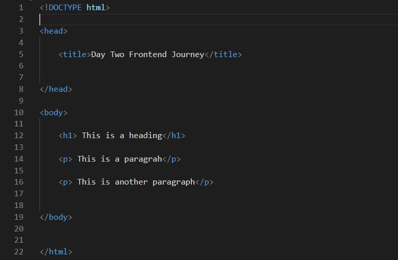
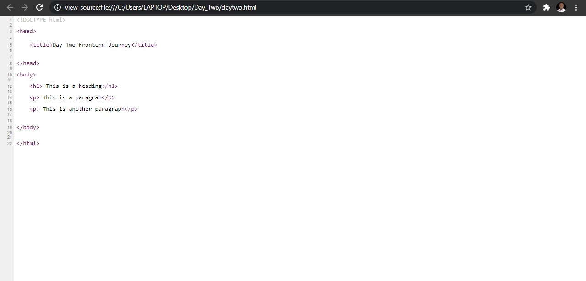
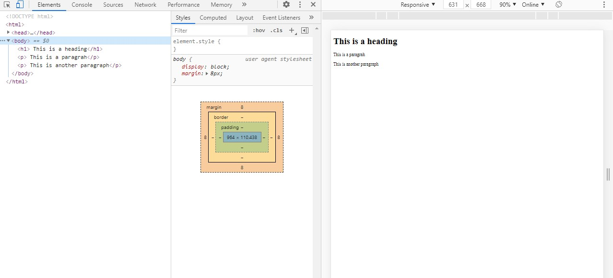

# My frontend Developer Journey  (Day Two)
## HTML

## Hypertext Markup Language know as HTML is the standard markup language fpor document designed to be displayed in a web browser . 
It can be assisted by technologies such as Cascading Style Sheet and scripting language such as javascript  and it was designed by Tim Berners-Lee in 1993.

## Kindly take note that :
* HTML is not a programming language
* It is the building block of the web
* Files must end with the html extension
* index.html is the root or homepage of a website
* HTML does not need a server to operate

# HTML STRUCTURE PAGE

## <!DOCTYPE html>
The standard file type for html 5. It explains what type of document the page is written in.

## Head
It has nothing to do with the output of the page.
It contains
* Page title
* links to css and javasrcipt files
* metadatas: the description and keywords which are use by google to request information about what the page actually contains

## Body
The actual markup which is going to display on the web page.

# Simple Google Chrome commands

 Ctrl + V  -> Shows the exact source code
 

F12  (functional key 12) -> Represent the Developer too in google which consists of the element tab, console tab, source tab and networking tab.

# BLOCK- LEVEL ELEMENT
A block-level element always starts on a new line and takes up the full width available (stretches out to the left and right as far as it can).
The 
 element is a block-level element.

# INLINE- LEVEL ELEMENT
An inline element does not start on a new line and it only takes up as much width as necessary.

